# zigbee 介绍#

考虑到最新的3.0已经发布，就以最新的规范来进行讲解。

**联盟网站**

	https://zigbee.org/

**官方3.0介绍**

	https://zigbee.org/zigbee-for-developers/zigbee-3-0/
**不错的博客**

	https://blog.csdn.net/jason_lm/article/category/7772109
## zigbee overview ##
### 主要参考文件 ###
	Webinar_ZigBee_3-0_Launch_FINAL
### 主要参考文件 ###

####Introduction
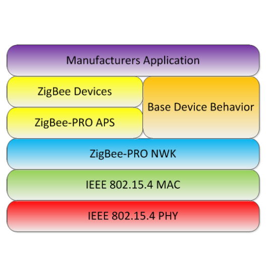
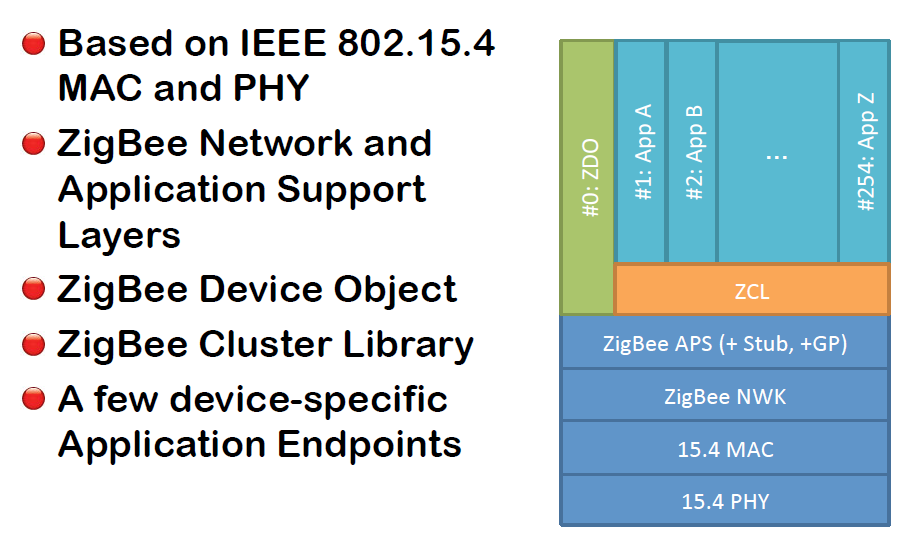
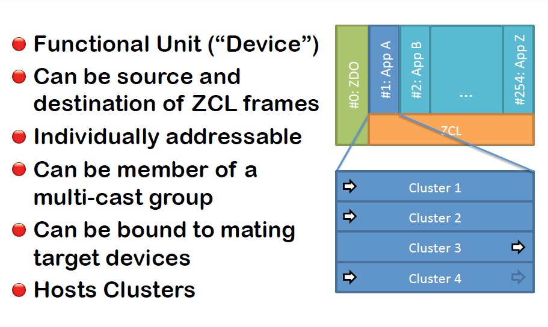
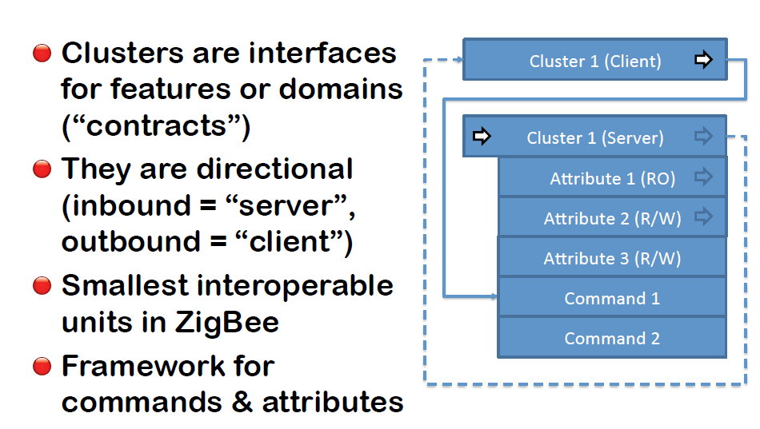

**demo**
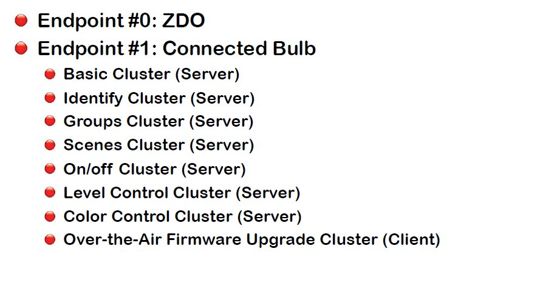
**ZigBee Device Object**
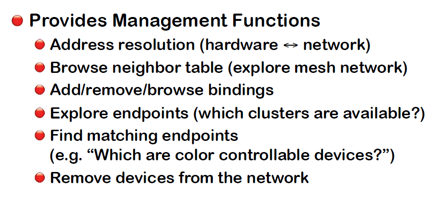
**Commands**
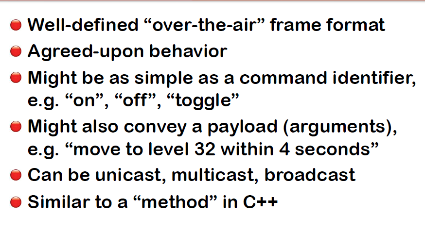
**Attributes**
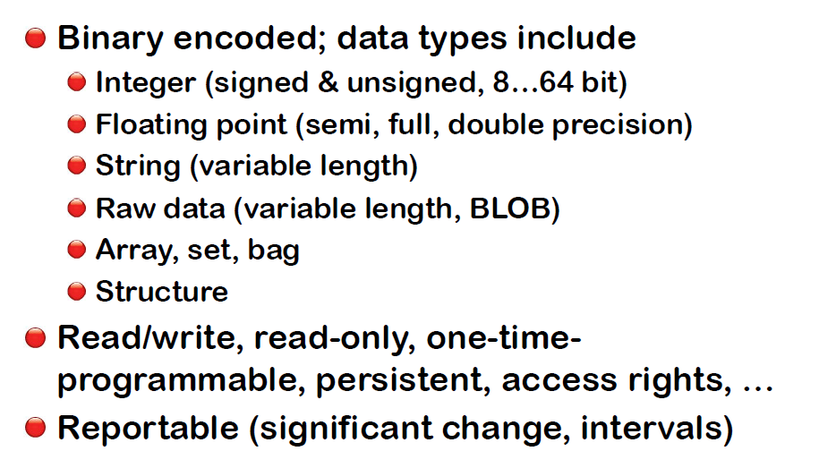

####ZigBee 3.0 Standard Documents
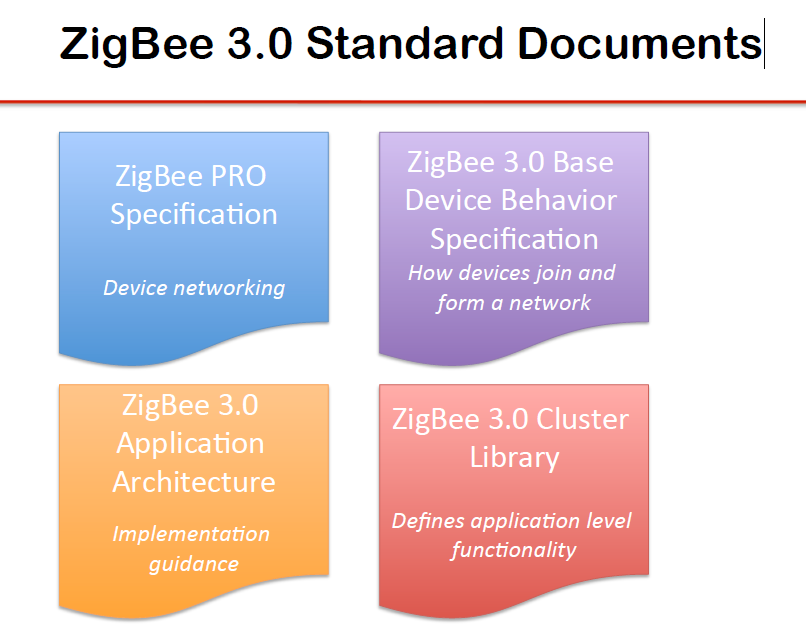

####Base Device Behavior: Contents
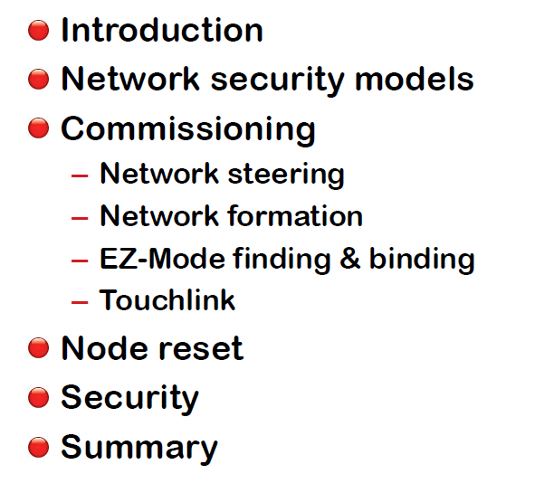

####Device Types
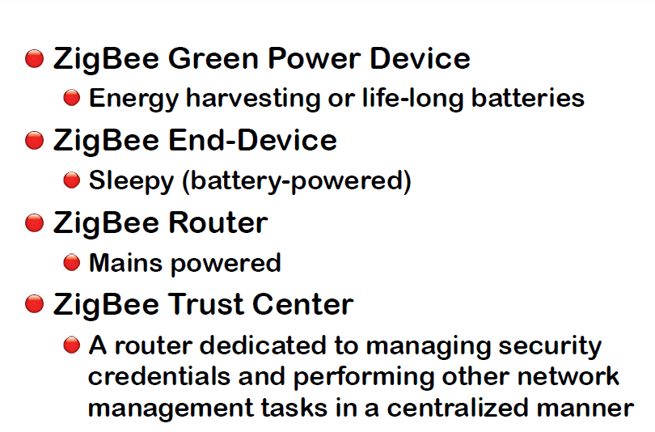

## Zigbee 的互操作 ##

zigbee3.0主要的特性，相对其他协议的主要升级

### 主要参考文件 ###
	04 2017 Interoperability ORIGINAL White Paper Final Musa and Shashank final_cn (2)

## Zigbee 的新设备类型 Green Power##

zigbee3.0添加新的设备类型，叫做Green Power

### 主要参考文件 ###
	docs-09-5499-26-batt-zigbee-green-power-specification

### 主要内容 ###

####Green Power stub
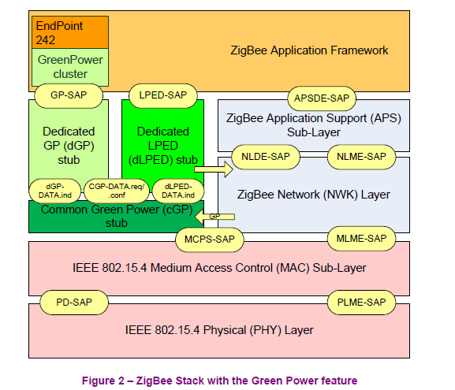

####GP Target device
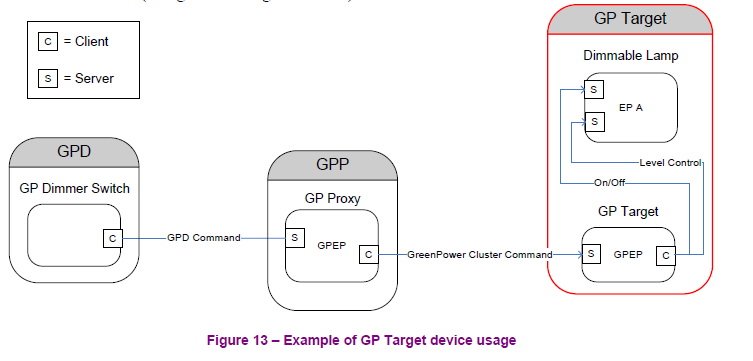

####GP Target+ device
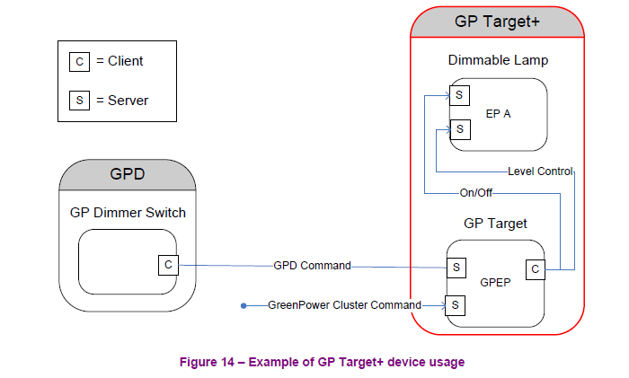

####GP Proxy device
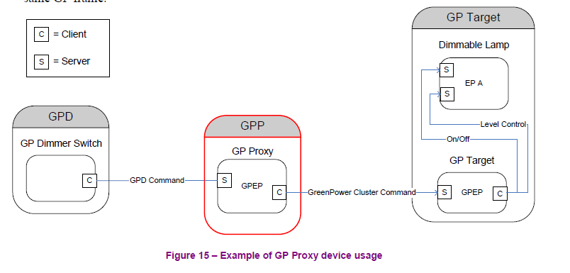

####GP Combo device
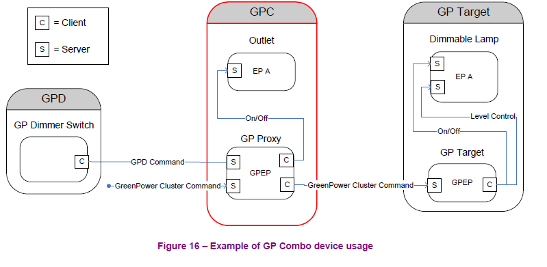

####demo
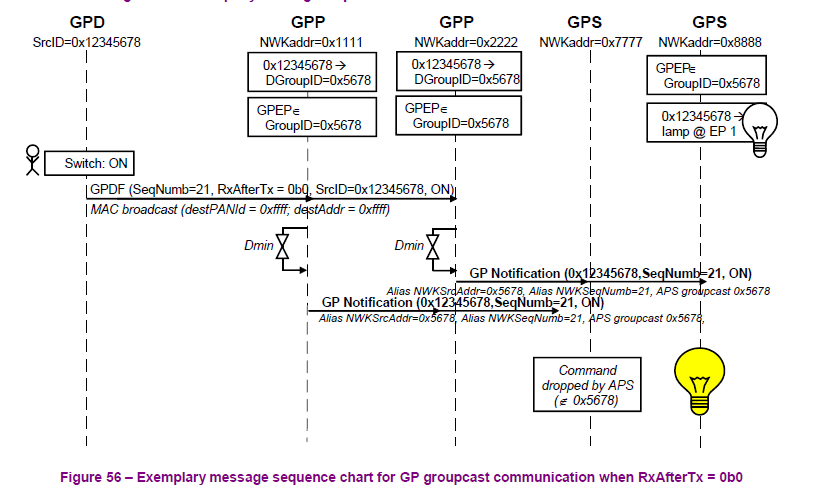

## zigbee 3.0在安全方面的内容 ##

### 主要参考文件 ###

	01 2017 zigbee security whitepaper final_CN (1)
### 主要内容概括 ###

  我们与领先的无线安全专家合作推出的业界领先的安全工具帮助我们成员开发了一些迄今最为安全的无线设备。这些新功能包括：

- 入网时的设备唯一身份验证（入网安全机制）
- 网络运行期间的密匙更新
- 空中固件升级（OTA）的安全措施
- 基于连接的逻辑加密

#### 入网时的设备唯一身份验证（入网安全机制） ####
zigbee 网络将会有两种网络组成（如下图）：
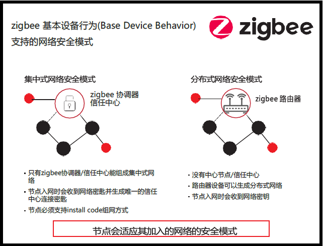
分布式安全模式的系统较易配置，包括两种设备类型：路由器和终端设备。如果zigbee路由器在启动时没有检测到已有网络，那它可以自主生成分布式安全网络。在分布式网络中，任何路由器都可以发送网络安全密钥（network key，网络消息的加解密钥，译者注）。随着更多的路由器和终端设备加入网络，已经存在于网络的路由器会以安全的方式发送网络密钥。网络上的所有设备都使用相同的网络密钥来加密消息。

集中式系统具备更高的安全性，其包括第三种设备类型—— 信任中心（Trust Center），通常情况下实现于网络协调器（见下图）。 TC组成集中式网络，只有路由器和终端设备拥有相关证书时才允许其加入网络。在集中式网络中，TC 是发布加密密钥的设备。在每个设备（或者一对设备）入网时，TC 还会发布唯一的TC 连接密钥（ Link Key）。

##### Install codes #####

Install Code 必须与以带外方式（out-of-band，即不通过zigbee 网络）预先输入TC 的密码匹配

#### 网络运行期间的密匙更新 ####
##### 滚动密匙（Rolling keys） #####

TC 定期地创建、分发、然后切换到新的网络密钥

#### OTA 升级 ####

#### 基于连接的逻辑加密 ####

##### 应用层加密 #####

通过在一对设备之间创建唯一的AES-128 加密密钥可以在网络中的任何两个设备之间建立逻辑安全连接，从而在网络的许多设备中某对设备能够形成“虚拟专用连接”

#### 其它安全技术 ####

- 为防止中继攻击（即攻击者截取命令消息后进行重放，例如打灯或关灯），每个zigbee 命令都包括一个帧计数器，接收设备检查会帧计数器并忽略重复的消息。
- zigbee 还支持动态频率切换。如果当前信道受损，例如遭受阻塞攻击，则网络可以迁移至不同的信道（频
- 率）上。

## zigbee 3.0 RQ CODE 规范 ##

### 主要参考文件 ###
	18-01000-007-ZigbeeAllianceQR_Code_RecommendedPractices
