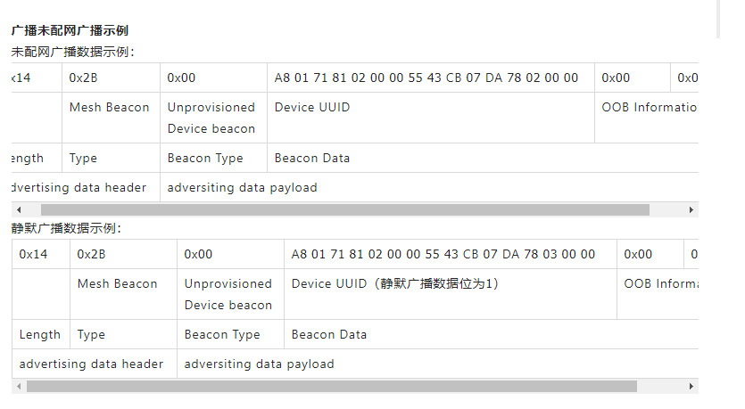
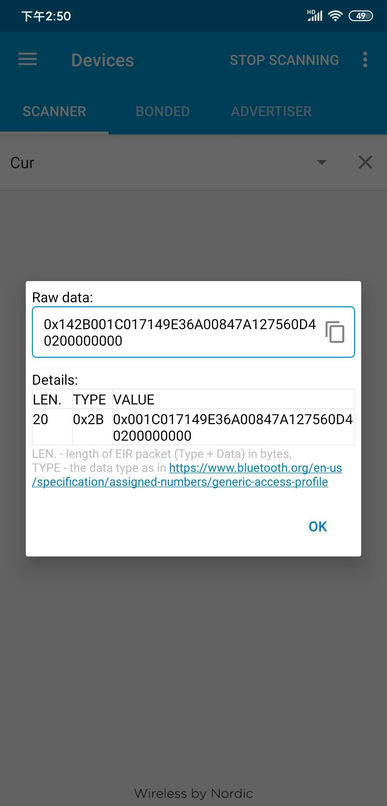
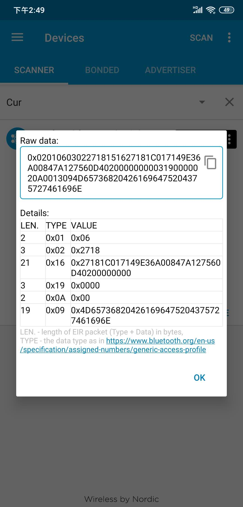
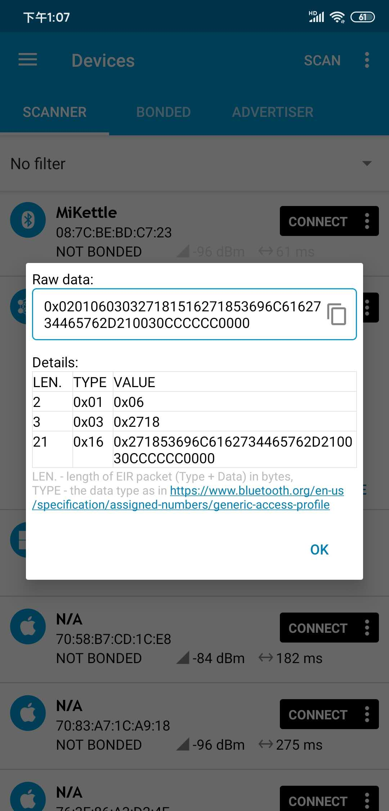
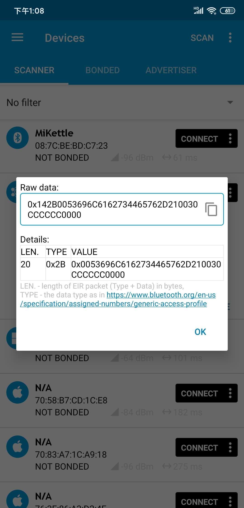

# 蓝牙ADV #

## GATT广播和mesh广播 ##
### gatt广播的参考code ###
	https://www.cnblogs.com/aikm/p/5022502.html
	https://www.aligenie.com/doc/357554/gtgprq
	http://www.jsons.cn/sha/ 计算sha256

**百度项目**

**slicicon**

