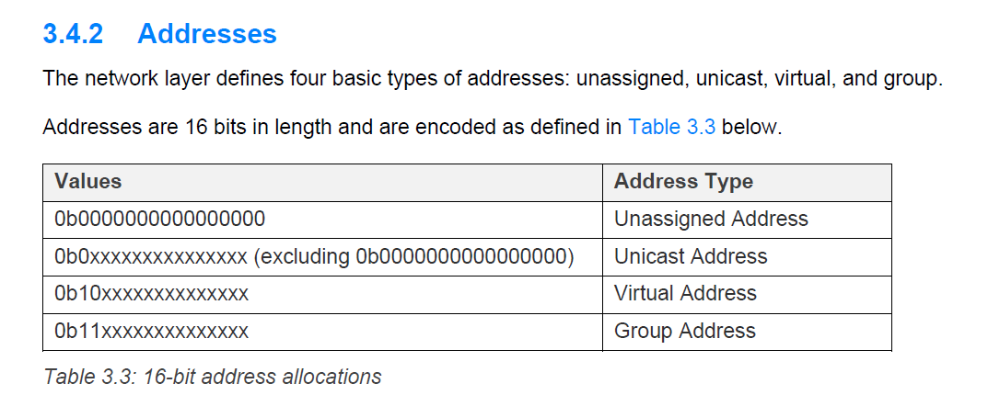
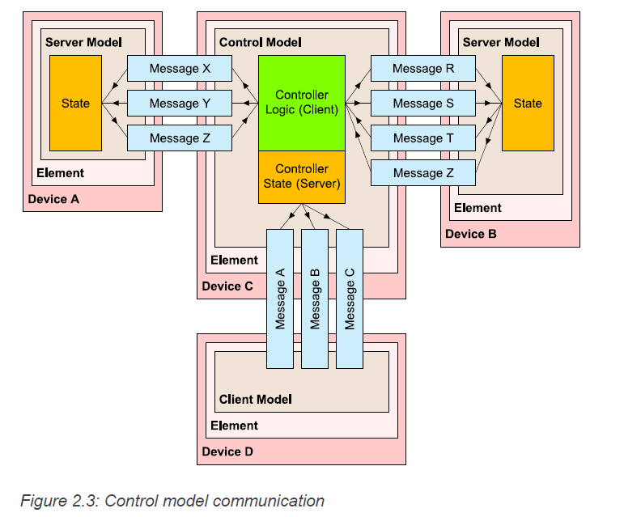
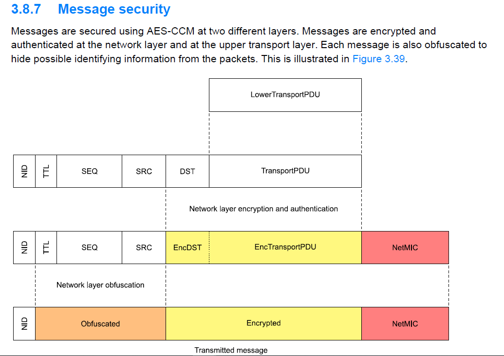

# 蓝牙MESH #

参考网站：

	https://blog.csdn.net/zhanghuaishu0/article/details/78770486

## 名称解释 ##
### Devices and Nodes ###

Devices which are part of a mesh network are
called nodes and those which are not are called
“unprovisioned devices”.
The process which transforms an unprovisioned device
into a node is called “provisioning”.
Provisioning is a secure procedure which results in an
unprovisioned device possessing a series of encryption
keys and being known to the Provisioner device, typically
a tablet or smartphone. One of these keys is called the
network key or NetKey for short.

###  Elements  ###

Some nodes have multiple, constituent parts, each of
which can be independently controlled. In Bluetooth
mesh terminology, these parts are called elements.

###  Addresses  ###

Bluetooth mesh defines three types of address.

- A unicast address uniquely identifies a single element.Unicast addresses are assigned to devices during the provisioning process.
- A group address is a multicast address which represents one or more elements. Group addresses are either defined by the Bluetooth Special Interest Group (SIG) and are known as SIG Fixed Group Addresses or are assigned dynamically. 4 SIG Fixed Group Addresses have been defined. These are named All-proxies, All-friends, All-relays and All-nodes. The terms Proxy, Friend, and Relay will be explained later in this paper.It is expected that dynamic group addresses will be established by the user via a configuration application and that they will reflect the physical configuration of a building, such as defining group addresses which correspond to each room in the building.
- A virtual address is an address which may be assigned to one or more elements, spanning one or more nodes. It takes the form of a 128-bit UUID value with which any element can be associated and is much like a label.Virtual addresses will likely be preconfigured at the point of manufacture and be used for scenarios such as allowing the easy addressing of all meeting room projectors made by this manufacturer.

### Publish/Subscribe ###

The act of sending a message is known as publishing.
Nodes are configured to select messages sent to
specific addresses for processing, and this is known
as subscribing.

### States and Properties ###
### Messages, States and Properties ###
The shorthand for the three types is GET, SET and STATUS.

### State Transitions ###

### Bound States ###
### Models ###
Models pull the preceding concepts together and
define some or all of the functionality of an element as it relates to the mesh network. Three categories of model
are recognized.

- A server model
- A client model
- Control models

### Generics ###
### Scenes ###

### Provisioning ###
The provisioning data includes a network key, the current IV Index, and the unicast address for each element.
The device key is derived from the ECDHSecret and ProvisioningSalt.

The provisioning process progresses through five steps and these are described next.

Step 1. Beaconing
Step 2. Invitation
Step 3. Exchanging Public Keys
Step 4. Authentication
Step 5. Distribution of the Provisioning Data
P240
### Features ###
There are four such optional features: the Relay, Proxy,
Friend, and the Low Power features。

### Node Configuration ###

## Mesh System Architecture ##
### Overview ###

### Bearer Layer ###
two bearers are defined and these are called the Advertising Bearer and the GATT Bearer.

### Network Layer ###
The network layer defines the various message
address types and a network message format which
allows transport layer PDUs to be transported by the
bearer layer.

### Lower Transport Layer ###
it performs segmentation and reassembly of PDUs

### Upper Transport Layer ###
The upper transport layer takes an access payload from the access layer or an internally generated upper transport layer Control message and transmits those messages to a peer upper transport layer.

For messages from the access layer, encryption and authentication of the message is performed using an application key. This allows the receiving upper transport layer to authenticate received messages.

Transport Control messages that are internally generated by the upper transport layer are only encrypted and authenticated at the network layer.

Transport Control messages：

### Access Layer ###

The access layer defines how higher-layer applications can use the upper transport layer. It defines the format of the application data; it defines and controls the application data encryption and decryption performed in the upper transport layer; and it checks whether the incoming application data has been received in the context of the right network and application keys before forwarding it to the higher layer.
简单总结：

- Defining the format of application data.
- Defining and controlling the encryption and decryption process which is performed in the upper transport layer.
- Verifying that data received from the upper transport layer is for the right network and application, before forwarding the data up the stack.

#### Publish and subscribe ####

### Foundation Models Layer ###

The foundation model layer is responsible for the
implementation of those models concerned with the
configuration and management of a mesh network.

P191

### Models Layer ###
The model layer is concerned with the implementation
of Models and as such, the implementation of behaviors,
messages, states, state bindings and so on, as defined in
one or more model specifications.

## security ##
At the heart of Bluetooth mesh security are three types
of security keys

- network key (NetKey).
- application key (AppKey).AppKeys are associated with only one NetKey.
- device key (DevKey).

### Nonce ###

## Privacy ##
A privacy key, derived from the NetKey is used to
obfuscate network PDU header values, such as the
source address.

## Replay Attacks ##
Sequence Number (SEQ) and IV Index

## Heartbeats ##
## TTL ##

## Mesh beacons ##

### Unprovisioned Device beacon ###

### Secure Network beacon ###

A Secure Network beacon may be sent for each subnet that a node is a member of to identify the subnet and inform about IV Index updates (see Section 3.10.5) and Key Refresh procedures (see Section 3.10.4).

## Mesh network management ##
### Key Refresh procedure ###

### Message processing flow ###
p133

## 天猫蓝牙 ##
参考网站：

	https://developer.aliyun.com/group/genieaiot?spm=a2c6h.12873639.0.d1002.d0684e15whpN8G#/?_k=utioir

## GATT广播和mesh广播 ##
### gatt广播的参考code ###
	https://www.cnblogs.com/aikm/p/5022502.html
	https://www.aligenie.com/doc/357554/gtgprq
	http://www.jsons.cn/sha/ 计算sha256

**百度项目**

**slicicon**

