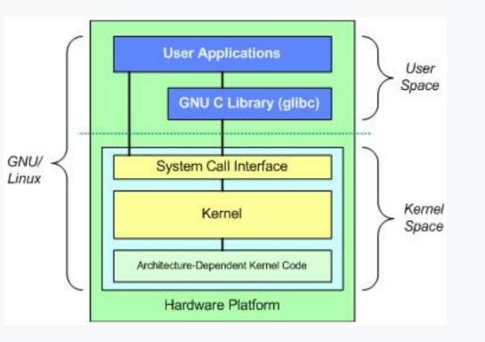
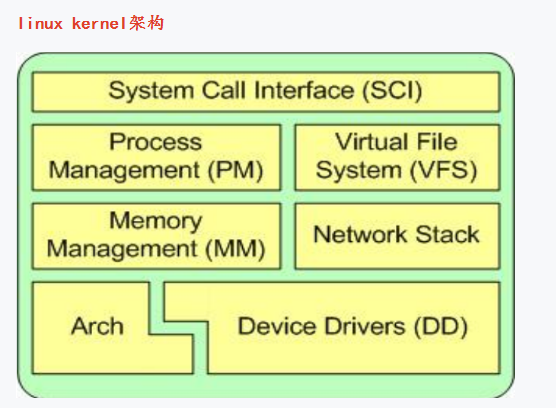

# 话说linux内核 #

## 内核和驱动的关联 ##
1、驱动属于内核的一部分

- 驱动就是内核中的硬件设备管理模块
- 驱动工作在内核态。
- 驱动程序故障可能导致整个内核崩溃
- 驱动程序漏洞会使内核不安全

2、内核和应用的关系

- 应用程序不属于内核，而是在内核之上的
- 应用程序工作在用户态，是受限制的。
- 应用程序故障不会导致内核崩溃
- 应用程序通过内核定义的API接口来调用内核工作
- 总结1：应用程序是最终目标
- 总结2：内核就是为应用程序提供底层资源管理的服务员

3、内核和根文件系统

- 根文件系统提供根目录。
- 进程1存放在根文件系统中（进程1就是用户态和内核态的交界处）
- **内核启动最后会去装载根文件系统。**
- 总结：根文件系统为操作系统启动提供了很多必备的资源：根目录、进程

## 内核的启动过程分析 ##

- head.S
- start_kernel
- rest_init

### 内核启动之init进程详解 ###
进程1 ： init：开始是内核态，后来转变为用户态。重点就做了一件事情，就是挂载根文件系统并试图找到用户态下的那个init程序。init进程要把自己转成用户态就必须运行一个用户态的应用程序（这个应用程序名字一般也叫init），要运行这个应用程序就必须得找到这个应用程序，要找到它就必须得挂载根文件系统，因为所有的应用程序都在文件系统中。

init进程大部分有意义的工作都是在用户态下进行的。init进程对我们操作系统的意义在于：其他所有的用户进程都直接或者间接派生自init进程。
主要作用是：构建了用户交互界面

init进程在内核态下面时，通过一个函数kernel_execve来执行一个用户空间编译连接的应用程序就跳跃到用户态了。
注意这个跳跃过程中进程号是没有改变的，所以一直是进程1.这个跳跃过程是单向的，
也就是说一旦执行了init程序转到了用户态下整个操作系统就算真正的运转起来了，以后只能在用户态下工作了，用户态下想要进入内核态只有走API这一条路了。

**kernel将根文件系统挂载成功后，kernel的任务就执行完了。**

## 内核启动的 cmdline常用参数 ##
| neme |意义|
| :---: |:---:| 
| root= |这个是用来指定根文件系统在哪里的|
| rootfstype= |根文件系统的文件系统类型，一般是jffs2、yaffs2、ext3、ubi|
| console= |mem=用来告诉内核当前系统的内存有多少|
| mem= |默认的下载文件名|
| init= |init=用来指定进程1的程序pathname，一般都是init=/linuxrc|

## 根文件系统的原理 ##
比如内核启动运行后的第一个程序（ init进程）、用于挂接文件系统的脚本、给用户提供操作界面的 shell 程序，应用程序所要依赖的库等，这些必要、基本文件的集合称为根文件系统，它们存放在一个分区中

- init进程的应用程序在根文件系统上
- 根文件系统提供了根目录/
- 内核启动后的应用层配置(etc目录)在根文件系统上。几乎可以认为：发行版=内核+rootfs
- shell命令程序在根文件系统上。譬如ls、cd等命令

## 到底什么是linuxrc ##
- /linuxrc是一个可执行的应用程序
- /linuxrc执行时引出用户界面 引入其他进程
- /linuxrc负责系统启动后的配置
- /linuxrc在嵌入式linux中一般就是busybox

**根目录里面最重要就是这个/linuxrc**

## 根文件系统构建及过程详解 ##

### inittab配置文件详解 ###

inittab的工作原理就是被/linuxrc（也就是busybox）执行时所调用起作用。

#### inittab格式解析 ####

	id:runlevels:action:process
明白各个action什么意思 在busybox-1.24.1中init.c定义了以下action

| neme |意义|
| :---: |:---:| 
| sysinit |指定的进程在访问控制台之前执行，这样的条目仅用于对某些设备的初始化，目的是为了使init在这样的设备上向用户提问有关运行级别的问题，init需要等待进程运行结束后才继续|
| respawn|如果process字段指定的进程不存在，就启动该进程，init不会等待处理结束，而是继续扫描inittab文件。当该进程被终止时，init将重新启动它。如果相应的进程已经存在，init就忽略该条目并继续扫描inittab文件|
| askfirst |类似respawn，主要用途是减少系统上执行的终端应用程序的数量。它将会促使init在控制台上显示“Please press Enter to active this console”的信息，并在重新启动进程之前等待用户按下“enter”键|
| wait|告诉init必须等到相应的进程执行完成之后才能继续执行|
| once |	启动进程，不会等待处理结束，而是继续处理下一条条目。当该进程被终止时，init不会重新启动它。从一个运行级别进入另一个运行级别时，如果相应的进程仍 在运行，init就不会重新启动该进程|
| ctratldel|当按下Ctrl+Alt+Delete组合键时，执行相应的进程|
| shutdown |当系统关机时，执行相应的进程|
| restart|根文件系统的文件系统类型，一般是jffs2、yaffs2、ext3ub|
| boot |只在系统启动时，init才处理这条条目，启动相应的进程，并不等待处理结束就去处理下一条条目。当这样的进程终止时，也不会重新启动它|
| bootwait|系统启动后，当第一次从单用户模式进入多用户模式时才处理该条目，init启动这样的进程，并且等待其处理结束才处理下一条条目，当该进程被终止时，也不重新启动它。|
| off |如果相应的进程正在运行，那么就发出一个警告信号，等待数秒后，再发出信号SIGKILL强制终止该进程。如果相应的进程不存在就忽略该条目|
| initdefault|指定一个默认的运行级别，如果指定了多个运行级别，其中最大的数字将是默认的运行级别。如果inittab文件没有包含该条目，在系统启动时会请求用户为其指定一个默认的运行级别|
| powerwait |当初接接到断电的信号时，处理指定的进程，并且等到处理结束后才去检查其他的条目|
| powerfail|当init接到断电的信 时，处理指定的进程，但是不等待该进程处理结束。|

#### rcS文件介绍 ####

/etc/init.d/rcS文件是linux的运行时配置文件中最重要的一个，其他的一些配置都是由这个文件引出来的。

	#!/bin/sh 需要继续添加环境变量，在后面：/new 即可 PATH=/sbin:/bin:/usr/sbin:/usr/bin runlevel=S prevlevel=N umask 022 export PATH runlevel prevlevel mount -a

- PATH=xxx 后面用export导出了这个PATH PATH这个环境变量是linux系统内部定义的一个环境变量
- runlevel= Linux系统有7个运行级别(runlevel)
- umask= umask值决定当前用户在创建文件时的默认权限。
- mount -a 是挂载所有的应该被挂载的文件系统，在busybox中mount -a时busybox会去查找一个文件/etc/fstab文件
- mdev mdev是udev的嵌入式简化版本，udev/mdev是用来配合linux驱动工作的一个应用层的软件，udev/mdev的工作就是配合linux驱动生成相应的/dev目录下的设备文件。

