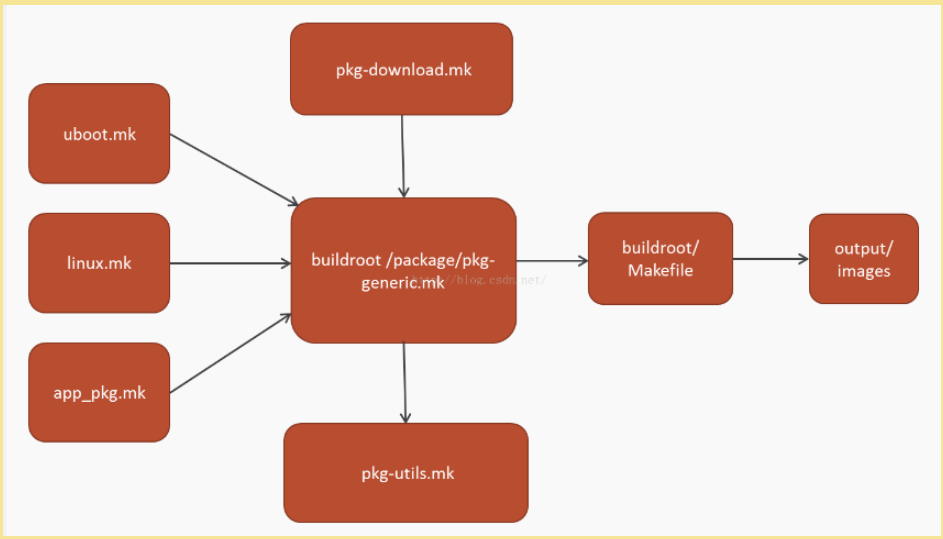

# builtroot #

## overview ##
整个Buildroot是由Makefile脚本和Kconfig配置文件构成的。你可以和编译Linux内核一样，通过buildroot配置，menuconfig修改，编译出一个完整的可以直接烧写到机器上运行的Linux系统软件(包含boot、kernel、rootfs以及rootfs中的各种库和应用程序)。

下载：git clone git://git.buildroot.net/buildroot
解压：tar -xzvf buildroot-2017.02.9.tar.gz

## buildroot 的工作原理 ##
Buildroot本身提供构建流程的框架，开发者按照格式写脚本，提供必要的构建细节，配置整个系统，最后自动构建出你的系统

## demo 构建一个 ##
### 查看一下当前的buildroot中支持的开发板 ###
 	
	make list-defconfigs

### 构建开发板 ###
	
	make menuconfig
