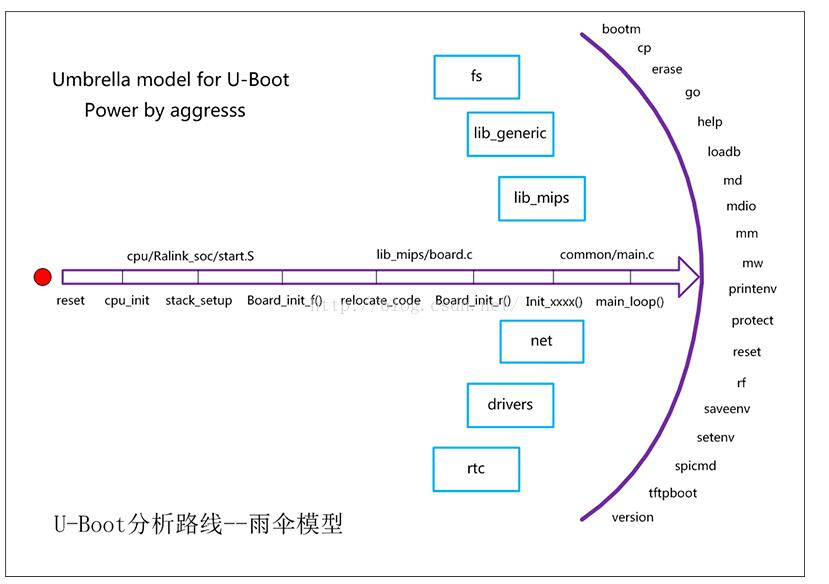

# uboot #

##官方web
	https://ftp.denx.de/pub/u-boot/
## 参考博客 ##

	https://blog.csdn.net/wangweijundeqq/category_7416245.html
## uboot简介 ##

uboot本质上是一个裸机程序（不是操作系统），一旦uboot开始SoC就会单纯运行uboot（意思就是uboot运行的时候别的程序是不可能同时运行的），一旦uboot结束运行则无法再回到uboot（所以uboot启动了内核后uboot自己本身就死了，要想再次看到      uboot界面只能重启系统。重启并不是复活了刚才的uboot，重启只是uboot的另一生）

一般使用命令控制

## uboot的工作模式 ##

* U-Boot的工作模式有启动加载模式和下载模式。*
* 
启动加载模式是Bootloader的正常工作模式，嵌入式产品发布Bootloader必须工作在这种模式下，Bootloader将 [嵌入式操作系统](file:///h)从FLASH中加载到SDRAM中运行，整个过程是自动的。

## uboot的常用命令 环境变量##

| bootdelay |执行自动启动（bootcmd中的命令）的等候秒数|
| :---: |:---:| 
| baudrate |串口控制台的波特率|
| netmask |以太网的网络掩码|
| ethaddr |以太网的MAC地址|
| bootfile |默认的下载文件名|
| bootcmd |传递给Linux内核的启动参数|
| baudrate |自动启动时执行命令|
| serverip |TFTP服务器端的IP地址|
| ipaddr |本地的IP地址|
| stdin |标准输入设备，一般是串口|
| stdout |标准输出，一般是串口，也可是LCD（VGA）|
| stderr |标准出错，一般是串口，也可是LCD（VGA）|
## uboot中对Flash和DDR的管理 ##

 	http://blog.csdn.net/qq_25827755/article/details/53671992

| Flash分区如下： |功能：|
| :---: |:---:| 
| 自由分区 |待用空间（一般做根文件系统使用）|
| rootfs |根文件系统文件|
| kernel |内核文件|
| var |环境变量|
| uboot |bootlater（必须在最前面）|

## 网络命令ping开发搭建使用&tftp服务器的安装&nfs网络服务器的安装 ##
	https://blog.csdn.net/wangweijundeqq/article/details/79128024

## bootloader  ##

### step1 ###

1. 设置 CPU 的启动模式，屏蔽中断
2. 关闭看门狗，关闭中断
3. 时钟初始化，设置时钟分频
4. bl lowlevel_init 下来初始化各个 bank，做 bank 的设置（即关闭 catch 和 MMU和各个bank的初始化包括DDR初始化 ）
5.建立映射表并开启MMU
6.跳转到第二阶段，无缝衔接UBOOT的第二阶段

### step2 之start_armboot###

 初始化本阶段要使到的硬件设备（如串口、 Flash 和网卡等）；
1.检测系统内存映射；
2.没有用户干预时将内核映像从 Flash 读到 DRAM 空间中；
3.为内核设置启动参数；
4.调用内核。

### step3 之uboot启动内核机制###

1.将内核搬移到DDR中
2.校验内核格式、CRC等
3.准备传参
4.跳转执行内核

note：
  操作系统内核本身就是一个裸机程序，和uboot、和其他裸机程序并没有本质区别。
  区别就是操作系统运行起来后在软件上分为内核层和应用层，分层后两层的权限不同，内存访问和设备操作的管理上更加精细（内核可以随便访问各种硬件，而应用程序只能被限制的访问硬件和内存地址）

## 内核的启动过程分析 ##

### 内核启动之init进程详解 ###
进程1 ： init：开始是内核态，后来转变为用户态。重点就做了一件事情，就是挂载根文件系统并试图找到用户态下的那个init程序。init进程要把自己转成用户态就必须运行一个用户态的应用程序（这个应用程序名字一般也叫init），要运行这个应用程序就必须得找到这个应用程序，要找到它就必须得挂载根文件系统，因为所有的应用程序都在文件系统中。

init进程大部分有意义的工作都是在用户态下进行的。init进程对我们操作系统的意义在于：其他所有的用户进程都直接或者间接派生自init进程。
主要作用是：构建了用户交互界面

