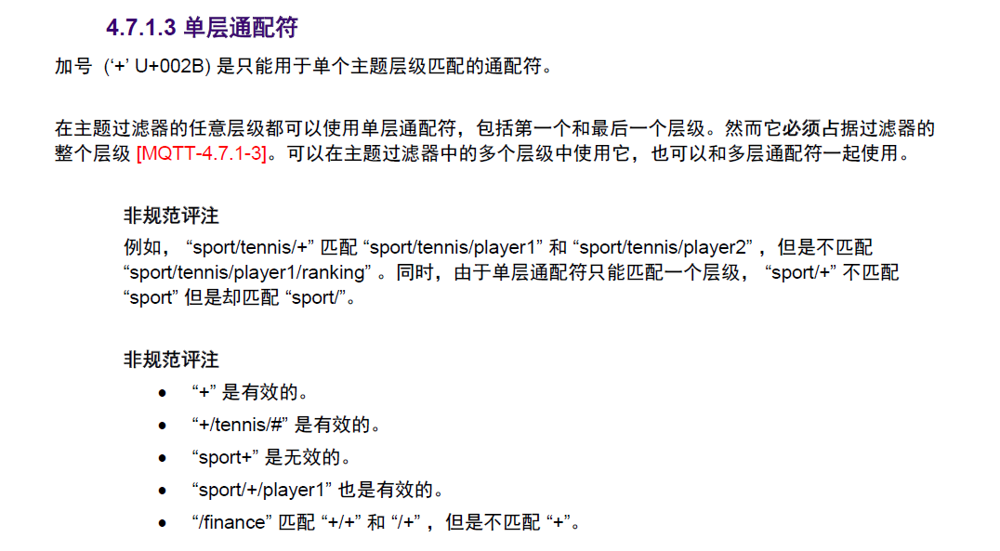

# mqtt关键内容 #

## 控制报文格式 ##
### MQTT控制报文的结构 ###
| :---: |
|固定报文Fixed header|
|可变报文 Variable header|
|有效负载 Payload|
### 固定报文 ###
| :---: |:---:| :---:|
|Bit|7-4 |3-0|
| byte1 | 控制报文类型 |对应标志位|
| byte2 |剩余长度  |
####  MQTT控制报文的类型  ####

| 名字 |值|报文流动方向|描述|
| :---: |:---:| :---:| :---:|
| Reserved |0|禁止|保留 |
| CONNECT |1|客服端到服务器|客户端请求连接服务器|
| CONNACK|2|服务器到客户端|连接报文确认|
| PUBLISH|3|双向|发布消息|
| PUBACK|4|双向|Qos 1 消息发布收到确认|
| PUBREC|5|双向|发布收到|
| PUBREL|6|双向|发布释放|
| PUBCOMP|7|双向|Qos 2消息发布完成|
| SUBSCRIBE|8|客户端到服务器|客户端订阅请求|
| SUBACK|9|服务器到客户端|订阅请求报文确认|
| UNSUBSCRIBE|10|客户端到服务器|客户端取消订阅请求|
| UNSUBACK|11|服务器到客户端|取消订阅请求确认|
| PINGREQ|12|客户端到服务器|心跳请求|
| PINGRESP|13|服务器到客户端|心跳相应|
| DISCONNECT|14|客户端到服务端|客户端断开连接|
| RESERVED|15|禁止|保留|

#### 对应标志位 ####
只有PUBLISH是变动的，其他都是固定的

| 控制报文 |固定报文标志|bit3|bit2|bit1|bit0|
| :---: |:---:| :---:| :---:|:---:|:---:|
| PUBLISH|Used in MQTT 3.1.1|DUP|QOS|QOS*|RETAIN|

####  剩余长度  ####
每个字节的低7位用于编码，最高位是标志位
最大是4字节

###  可变包头  ###

#### 报文标识符 ####

很多控制报文的可变报头部分包含一个两字节的报文标识符字段。
这些报文是PUBLISH（QoS>0时）， PUBACK，PUBREC，PUBREL，PUBCOMP，SUBSCRIBE, SUBACK，UNSUBSCIBE，UNSUBACK。
控制报文必须包含一个非零的16位报文标识符（Packet Identifier）[MQTT-2.3.1-1]。

客户端每次发送一个新的这些类型的报文时都必须分配一个当前未使用的报文标识符 [MQTT-2.3.1-2]。如果一个客户端要重发这个特殊的控制报文，在随后重发那个报文时，它必须使用相同的标识符。当客户端处理完这个报文对应的确认后，这个报文标识符就释放可重用。

| 名字 |可变报头|
| :---: |:---:|
| CONNECT |N|
| CONNACK|N|
| PUBLISH|Y(Qos>0)|
| PUBACK|Y|
| PUBREC|Y|
| PUBREL|Y|
| PUBCOMP|Y|
| SUBSCRIBE|Y|
| SUBACK|Y|
| UNSUBSCRIBE|Y|
| UNSUBACK|Y|
| PINGREQ|N|
| PINGRESP|N|
| DISCONNECT|N|

###  有负载  ###
| 名字 |有效负载|
| :---: |:---:|
| CONNECT |Y|
| CONNACK|N|
| PUBLISH|可选|
| PUBACK|N|
| PUBREC|N|
| PUBREL|N|
| PUBCOMP|N|
| SUBSCRIBE|Y|
| SUBACK|Y|
| UNSUBSCRIBE|N|
| UNSUBACK|N|
| PINGREQ|N|
| PINGRESP|N|
| DISCONNECT|N|

## MQTT控制报文内容 ##

### CONNECT – 连接服务端 ###

其中固定包头的剩余长度为：
**剩余长度等于可变报头的长度（10字节）加上有效载荷的长度**

##### 可变报头 #####
CONNECT报文的可变报头按下列次序包含四个字段：

- 协议名（Protocol Name）固定（MQTT）
- 协议级别（Protocol Level）固定（0x40）
- 连接标志（Connect Flags）
- 保持连接（Keep Alive）

###### 连接标志 

| bit |7|6|5|4|3|2|1|0|
| :---: |:---:| :---:| :---:|
|  |user nane flag|password flag|will retain |will QOS |will QOS |will FLAG |CLEAN SESSION |RESERVED |

###### 清理会话 
如果清理会话（CleanSession）标志被设置为0，服务端必须基于当前会话（使用客户端标识符识别）的状态恢复与客户端的通信。如果没有与这个客户端标识符关联的会话，服务端必须创建一个新的会话。在连接断开之后，客户端和服务端必须保存会话信息 [MQTT-3.1.2-4]。当清理会话标志为0的会话连接断开之后，服务端必须将之后的QoS 1和QoS 2级别的消息保存为会话状态的一部分，如果这些消息匹配断开连接时客户端的任何订阅 [MQTT-3.1.2-5]。服务端也可以保存满足相同条件的QoS 0级别的消息。

如果清理会话（CleanSession）标志被设置为1，客户端和服务端必须丢弃之前的任何会话并开始一个新的会话。会话仅持续和网络连接同样长的时间。与这个会话关联的状态数据不能被任何之后的会话重用 [MQTT-3.1.2-6]。

客户端的会话状态包括：

- 已经发送给服务端，但是还没有完成确认的QoS 1和QoS 2级别的消息
- 已从服务端接收，但是还没有完成确认的QoS 2级别的消息。

服务端的会话状态包括：

- 会话是否存在，即使会话状态的其它部分都是空。
- 客户端的订阅信息。
- 已经发送给客户端，但是还没有完成确认的QoS 1和QoS 2级别的消息。
- 即将传输给客户端的QoS 1和QoS 2级别的消息。
- 已从客户端接收，但是还没有完成确认的QoS 2级别的消息。
- 可选，准备发送给客户端的QoS 0级别的消息。

###### 遗嘱标志 
遗嘱（Will Message）消息必须被存储在服务端并且与这个网络连接关联。之后网络连接关闭时，服务端必须发布这个遗嘱消息，除非服务端收到DISCONNECT报文时删除了这个遗嘱消息

遗嘱消息发布的条件，包括但不限于：
- 服务端检测到了一个I/O错误或者网络故障。
- 客户端在保持连接（Keep Alive）的时间内未能通讯。
- 客户端没有先发送DISCONNECT报文直接关闭了网络连接。
- 由于协议错误服务端关闭了网络连接。

如果遗嘱标志（will FLAG）被设置为1，连接标志中的Will QoS和Will Retain字段会被服务端用到，同时有效载荷中必须包含Will Topic和Will Message字段。

如果遗嘱保留（will retain）被设置为1，服务端必须将遗嘱消息当作保留消息发布

###### 用户名标志&密码标志 

负载是否包含相关内容

###### 保持连接 

保持连接（Keep Alive）是一个以秒为单位的时间间隔，表示为一个16位的字，它是指在客户端传输完成一个控制报文的时刻到发送下一个报文的时刻，两者之间允许空闲的最大时间间隔

#### 有效负载 ####

如果包含的话，必须按这个顺序出现：客户端标识符，遗嘱主题，遗嘱消息，用户名，密码

---

### PUBLISH – 发布消息 ###

#### 固定报头 ####

**DUP：重发标志**

如果DUP标志被设置为0，表示这是客户端或服务端第一次请求发送这个PUBLISH报文。如果DUP标志被设置为1，表示这可能是一个早前报文请求的重发。

**服务质量等级**
**保留标志**

如果客户端发给服务端的PUBLISH报文的保留（RETAIN）标志被设置为1，服务端必须存储这个应用消息和它的服务质量等级（QoS），以便它可以被分发给未来的主题名匹配的订阅者 [MQTT-3.3.1-5]。一个新的订阅建立时，对每个匹配的主题名，如果存在最近保留的消息，它必须被发送给这个订阅者 [MQTT-3.3.1-6]。如果服务端收到一条保留（RETAIN）标志为1的QoS 0消息，它必须丢弃之前为那个主题保留的任何消息。它应该将这个新的QoS 0消息当作那个主题的新保留消息，但是任何时候都可以选择丢弃它。

## 网络连接 ##

### 服务质量等级和协议流程 ###

- QoS 0:最多分发一次 

- QoS 1: 至少分发一次

- QoS 2: 仅分发一次

## 主题名和主题过滤器 ##

- 主题层级分隔符  斜杠（‘/’ U+002F）

- 多层通配符      数字标志（‘#’ U+0023）

- 单层通配符      加号 (‘+’ U+002B) 
   

**以$开头的主题**

服务端不能将 $ 字符开头的主题名匹配通配符 (#或+) 开头的主题过滤器 [MQTT-4.7.2-1]。服务端应该阻止客户端使用这种主题名与其它客户端交换消息
     