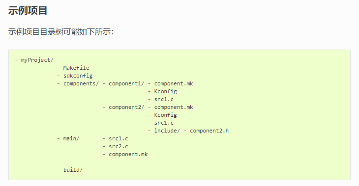
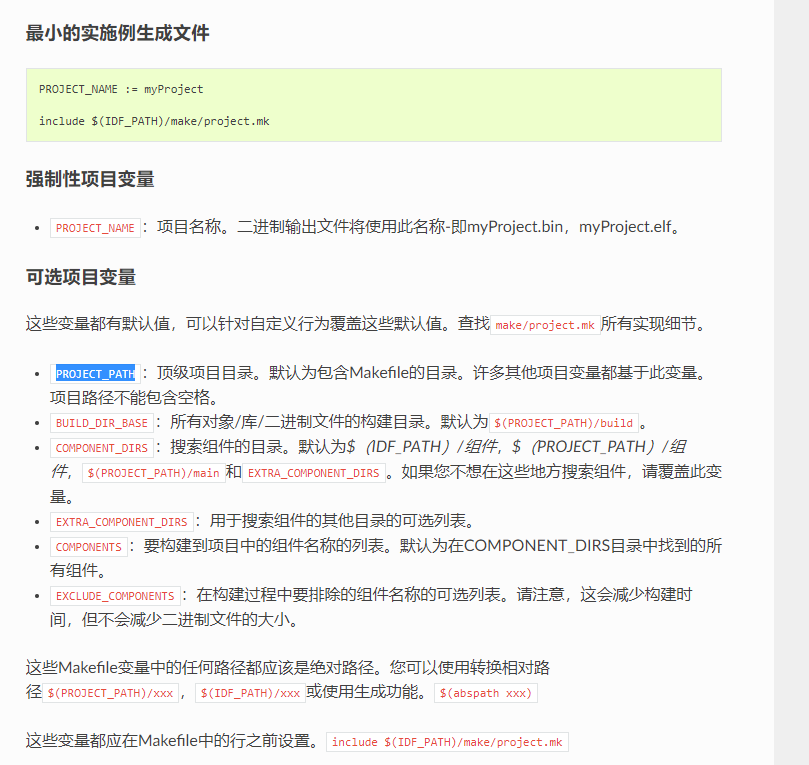
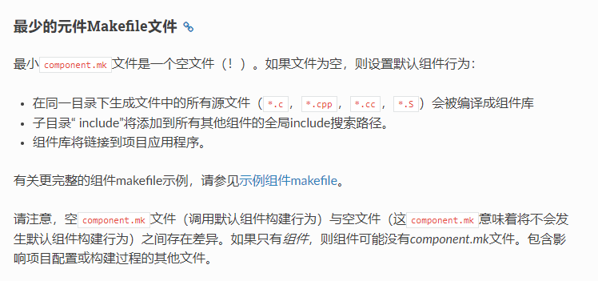
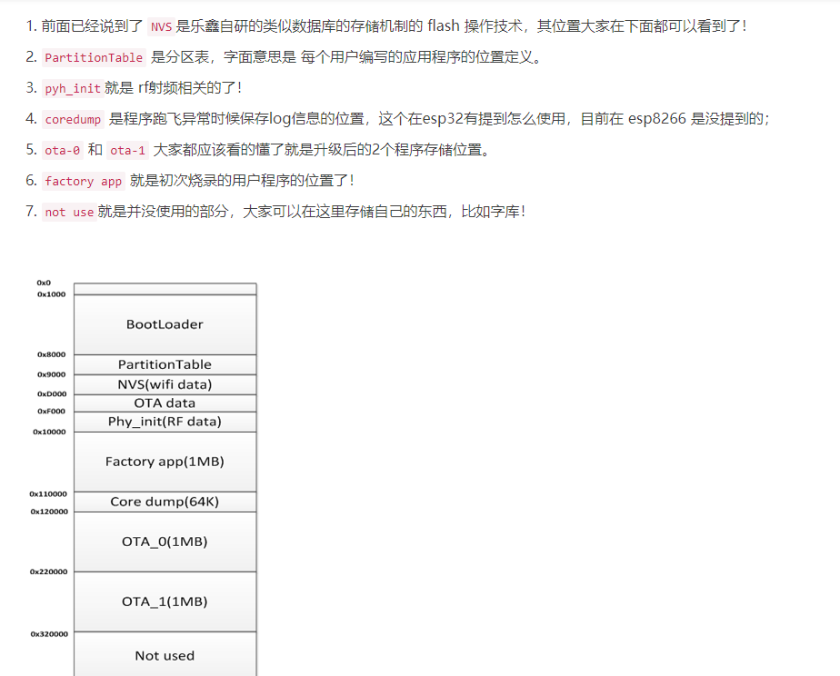
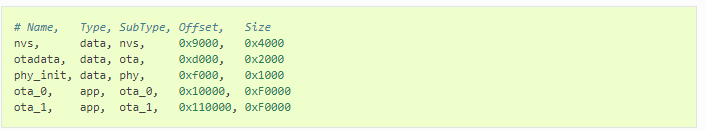
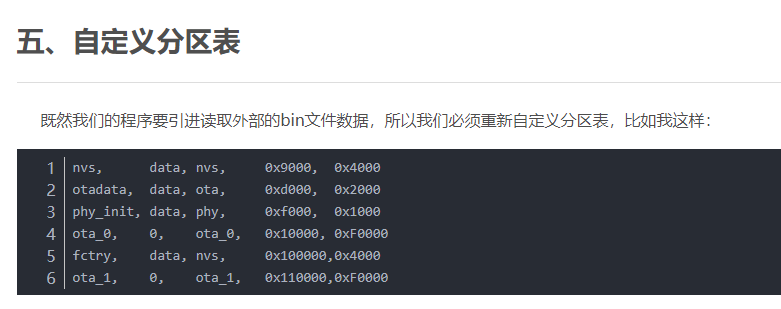
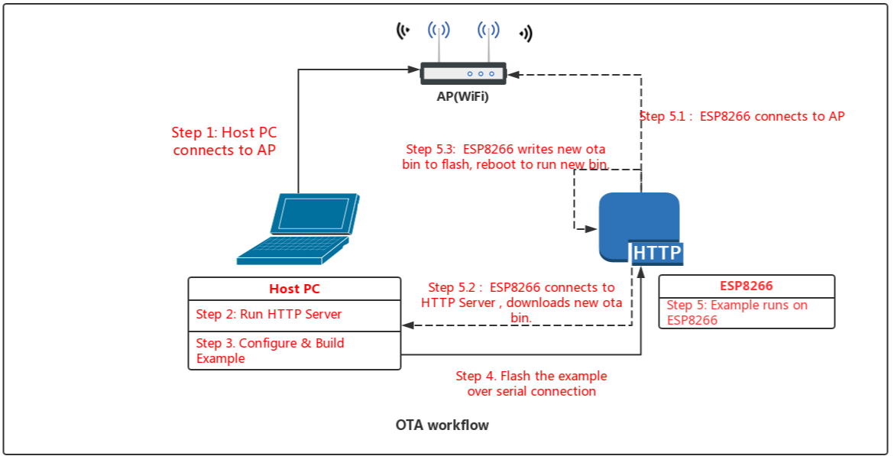

# 乐鑫rtos_3.x工程建立及flash分区及AOT #

# 工程建立 #



# flash分区  #

# 自定义NVS
## 单个 bin 生成
在调试过程中，建议使用该方式。

mass_mfg 目录中有一参考配置：single_mfg_config.csv，请拷贝成自己的配置文件，如 my_single_mfg_config.csv。
```
cp single_mfg_config.csv my_single_mfg_config.csv
```

使用自己的 ProductKey、ProductSecret、DeviceName、DeviceSecret 对 my_single_mfg_config.csv 进行修改：
```
key,type,encoding,value
aliyun-key,namespace,,
DeviceName,data,string,config
DeviceSecret,data,string,dsj3RuY74pgCBJ3zczKz1LaLK7RGApqh
ProductKey,data,string,a10BnLLzGv4
ProductSecret,data,string,pVfLpS1u3A9JM0go
```

将 config，dsj3RuY74pgCBJ3zczKz1LaLK7RGApqh，a10BnLLzGv4，pVfLpS1u3A9JM0go 修改为你对应的值。

修改完成后，使用如下命令生成对应的 NVS 分区：
```
$IDF_PATH/components/nvs_flash/nvs_partition_generator/nvs_partition_gen.py --input my_single_mfg_config.csv --output my_single_mfg.bin --size 0x4000
```
如针对 esp8266 平台，请使用如下命令：
```
$IDF_PATH/components/nvs_flash/nvs_partition_generator/nvs_partition_gen.py --input my_single_mfg_config.csv --output my_single_mfg.bin --size 0x4000 --version v1
```
# demo 默认 #


默认的采用分区文件是在：ESP8266_RTOS_SDK/components/partition_table/partitions_two_ota.csv

# 创建自定义表 #

ota flash：


几个自定义demo


If customers want to use their own partition tables with specific partition location. Please see following steps:

## Step 1: Create partition file

Create a partition managment file with "cvs" formate, please refer to "doc/en/api-guides/partition-tables.rst"

## Step 2: Select custom partition mode

1. Select custom partition tables at "menuconfig":

```
Partition Table  --->
    Partition Table (XXXXXX)  --->
        (X) Custom partition table CSV
```

2. Configurate custom partition location at:

```
(XXXXXX)Custom partition CSV file
```

Note: System will add the absolute path of the project to the head of the "Custom partition CSV file" automatically when compling.

3. Configurate patition table location if necessary:

```
(XXXXXX)Partition table offset address at flash
```

## Step 3: Configurate application location:

Configurate application location at "mennuconfig" like following base on partition table file.

If you select 1MB flash, application location configuration menu is like following:

```
Partition Table  --->

    [*] Support to setup partition parameter of APP2
    (0x5000) App1 offset address 
    (0x7B000) App1 size by bytes 
    (0x85000) App2 offset address
    (0x7b000) App2 size by bytes
```

If you select 2MB flash and above size, application location configuration menu is like following:

```
Partition Table  --->

    (0x10000) APP1 partition offset
    (0xF0000) APP1 partition size(by bytes)
```

Note: The firmware location information must be same as partition table file. **make ota flash** will only download the app1 at **APP1 partition offset**.


#OTA 

## Workflow ##


## 官方demo_use ##



**运行流程**

Flash the example through serial port with command "make flash" to update the OTA_0 app image. In first boot, the bootloader loads this OTA_0 app image which then will execute an OTA update (triggered in the example code). The OTA update will download a new image from an http server and save it into the OTA_1 partition. After that, the example code will update the ota_data partition to indicate the new app partition, and then reboot, which leads to the second boot. During the second boot, the bootloader will read the ota_data, and select to run the new OTA image.


## demo key code ##
/****************************************************************/
python 自带HTTP：
	python -m SimpleHTTPServer 8070
/****************************************************************/

    const esp_partition_t *configured = esp_ota_get_boot_partition();
    const esp_partition_t *running = esp_ota_get_running_partition();

    if (configured != running) 
	{
        ESP_LOGW(TAG, "Configured OTA boot partition at offset 0x%08x, but running from offset 0x%08x",
                 configured->address, running->address);
        ESP_LOGW(TAG, "(This can happen if either the OTA boot data or preferred boot image become corrupted somehow.)");
    }
    ESP_LOGI(TAG, "Running partition type %d subtype %d (offset 0x%08x)",
             running->type, running->subtype, running->address);

/****************************************************************/

    update_partition = esp_ota_get_next_update_partition(NULL);//
	
    ESP_LOGI(TAG, "Writing to partition subtype %d at offset 0x%x",
             update_partition->subtype, update_partition->address);

/****************************************************************/

	err = esp_ota_begin(update_partition, OTA_SIZE_UNKNOWN, &update_handle);

/****************************************************************/


	static void esp_ota_firm_init(esp_ota_firm_t *ota_firm, const esp_partition_t *update_partition)
	{
	    memset(ota_firm, 0, sizeof(esp_ota_firm_t));
	    ota_firm->state = ESP_OTA_INIT;
	    ota_firm->ota_num = get_ota_partition_count();
	    ota_firm->update_ota_num = update_partition->subtype - ESP_PARTITION_SUBTYPE_APP_OTA_0;
	
	    ESP_LOGI(TAG, "Totoal OTA number %d update to %d part", ota_firm->ota_num, ota_firm->update_ota_num);
	
	}

    bool flag = true;
    esp_ota_firm_t ota_firm;

    esp_ota_firm_init(&ota_firm, update_partition);

/****************************************************************/

	err = esp_ota_write( update_handle, (const void *)ota_write_data, buff_len);

/****************************************************************/
	esp_ota_end(update_handle)
/****************************************************************/
	err = esp_ota_set_boot_partition(update_partition);
/****************************************************************/
	esp_restart();
/****************************************************************/


